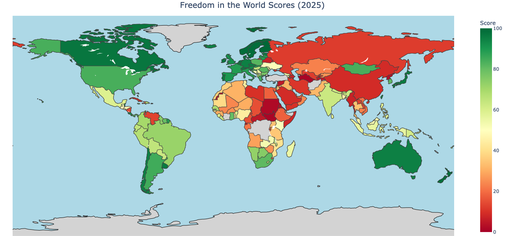

# Freedom House Data Visualization 🌍


## Overview

An interactive dashboard visualizing global freedom scores from Freedom House data. This application provides insightful visualizations of freedom trends across countries and over time using interactive maps, charts, and detailed analytics.

## Features

### 🗺️ Interactive World Map
- Choropleth map color-coded by freedom scores
- Multiple color schemes (Red-Yellow-Green, Blue Scale, Viridis, Plasma)
- Zoom and pan functionality
- Hover tooltips with country information

### 📈 Time Series Analysis
- Interactive line charts showing historical trends
- Multi-country comparison tools
- Year selection with dynamic updates

### 🔍 Country Insights
- Detailed country profiles on click
- Historical data visualization
- Freedom status classification

### 📊 Change Analytics
- Year-over-year change tracking
- Categorization of countries (Improved/Declined/No Change)
- Statistical analysis of freedom trends

## Data Sources

- Freedom in the World (FIW) 2013-2024
- Freedom on the Net (FOTN)
- Nations in Transit (NIT) 2005-2024

## Installation

### Prerequisites
- Python 3.7+
- pip package manager

### Setup Instructions

1. **Clone the repository:**
   ```bash
   git clone https://github.com/zafariabbas68/Freedom-House-Map.git
   cd Freedom-House-Map